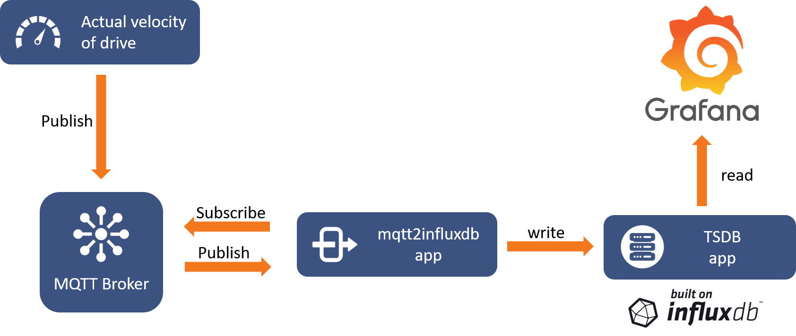

# mqttscanner
 Scans MQTT topics of a certain broker pushes it into a time series database.
  
 Link to Repository: https://github.com/wernerpaulin/mqttscanner

<!-- APP SHIELDS -->

<!-- APP LOGO -->
 

  

  <h3 align="center">mqttscanner</h3>

  

    This app is written in Python® 3. Scans MQTT topics of a certain broker and its values to an time series database built on InfluxDB®.
  

<!-- TABLE OF CONTENTS -->

  
Table of Contents

  <ol>
    <li>
      <a href="#about-the-app">About The App</a>
      <ul>
        <li><a href="#gallery">Gallery</a></li>
        <li><a href="#features">Features</a></li>
        <li><a href="#built-with">Built With</a></li>
      </ul>
    </li>
    <li>
      <a href="#getting-started">Getting Started</a>
      <ul>
        <li><a href="#prerequisites">Prerequisites</a></li>
        <li><a href="#usage">Usage</a></li>
      </ul>
    </li>
    <li><a href="#communication">Communication</a>
      <ul>
        <li><a href="#interfaces">Interfaces</a></li>
        <li><a href="#published-ports">Ports Published By This App</a></li>
      </ul>
    </li>
    <li><a href="#data-management">Data Management</a></li>
      <ul>
        <li><a href="#environmental-variables">Environmental Variables</a></li>
        <li><a href="#volumes">Volumes</a></li>
      </ul>
    <li><a href="#information">Information</a></li>
    <li><a href="#legal-statemets">Legal Statements</a></li>
  </ol>

<!-- ABOUT THE APP -->
## About The App
### Gallery

### Features
* tbd...

### Built With
| Technology | Description |
| -------------- | ----------- |
| [Python®](https://www.python.org/) | asyncio for concurrent execution of coroutines |
| [Eclipse Paho®](https://www.eclipse.org/paho/) | MQTT client |
| [InfluxDB®](https://www.influxdata.com/) | Time series database |
| [Docker®](https://www.docker.com/) | Container technology |

<!-- GETTING STARTED -->
## Getting Started

Find this app in the App Store and use it in a machine.

### Prerequisites

This app requires a MQTT broker which can either run as an app or on a different host but in the same network of the Runtime.
It also requires an influxdb app running on the Runtime or on a different host.

### Usage
1. tbd

<!-- COMMUNICATION -->
## Communication

### Published Ports By This App
| Container Port | Protocol | Description |
| -------------- | -------- | ----------- |
| n.a. | | |

**Please note: Ports can be mapped to different host ports in the machine settings**

<!-- DATA MANAGEMENT -->
## Data Management

### Environmental Variables
Environmental variables are used to initialize or define a certain functionality of an app and can be changed in the machine settings:
| Variable | Default Value | Changeable by User | Description | 
| -------- | ------------- | ------------------ | ----------- |
| MQTT_BROKER_IP | mosaiq.eclipsemosquitto | yes | Hostname or IP address of MQTT broker | 
| MQTT_BROKER_PORT | 1883 | yes | Port used by the MQTT broker |
| MQTT_BROKER_KEEPALIVE | 60 | yes | Maximum time that this app does not communicate with the broker |

### Volumes
Mount points are access points to volumes (like paths) provided to the app to read and write data:

| Mount Point | Default Data | Changeable by User | Description | 
| -------- | ------------- | ------------------ | ----------- |
| n.a. | | |

<!-- INFORMATION -->
## Information
| Developer | Compatibility | Size on Runtime | Copyright | License |
| ----------| ------------- |---------------- | --------- | ------- |
| [Lenze SE](https://www.lenze.com/) | Requires Runtime 1.0 or later | 50.7 MB | © 2021- [Lenze SE](https://www.lenze.com/) | MIT License. See `LICENSE` for more information. |

## Legal Statements
* "Python®" and the Python logos are trademarks or registered trademarks of the Python Software Foundation.
* "Eclipse®", "Mosquitto®", Paho® and the respective logos are trademarks or registered trademarks of the Eclipse Foundation.
* "Docker®" and "Docker Hub®" are trademarks or registered trademarks of Docker.
* "InfluxDB®" and the respective logo is a trademark or registered trademark by InfluxData, which is not affiliated with, and does not endorse, this product.